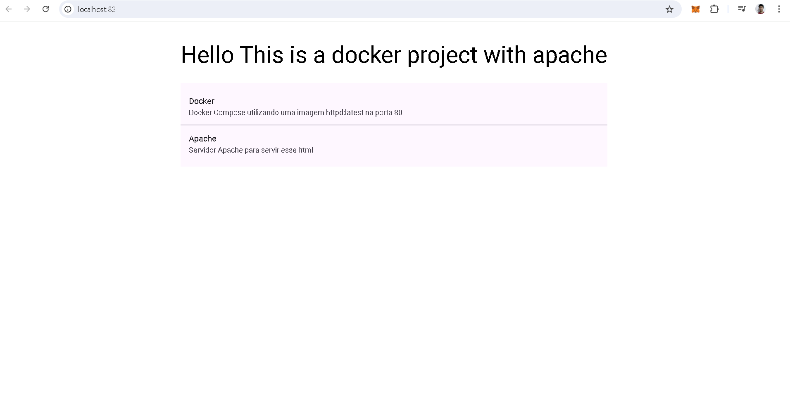
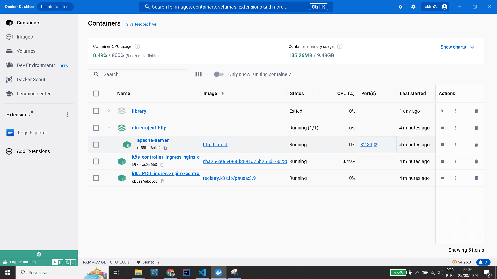

# Um projeto basico de servidor apache dentro de um container docker
Fiz um docker compose que tem um serviço apache usando a imagem httpd:latest
E o resultado final foi esse:

(OBS: utilizei a porta 82 pois a porta 80 do meu computador esta sendo utilizada por um ingress com nginx com alguns testes meus do kubernetes)

